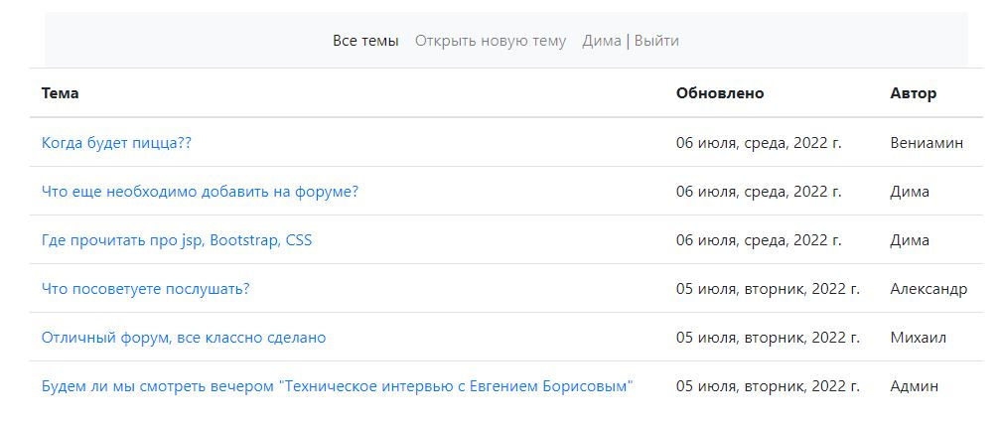
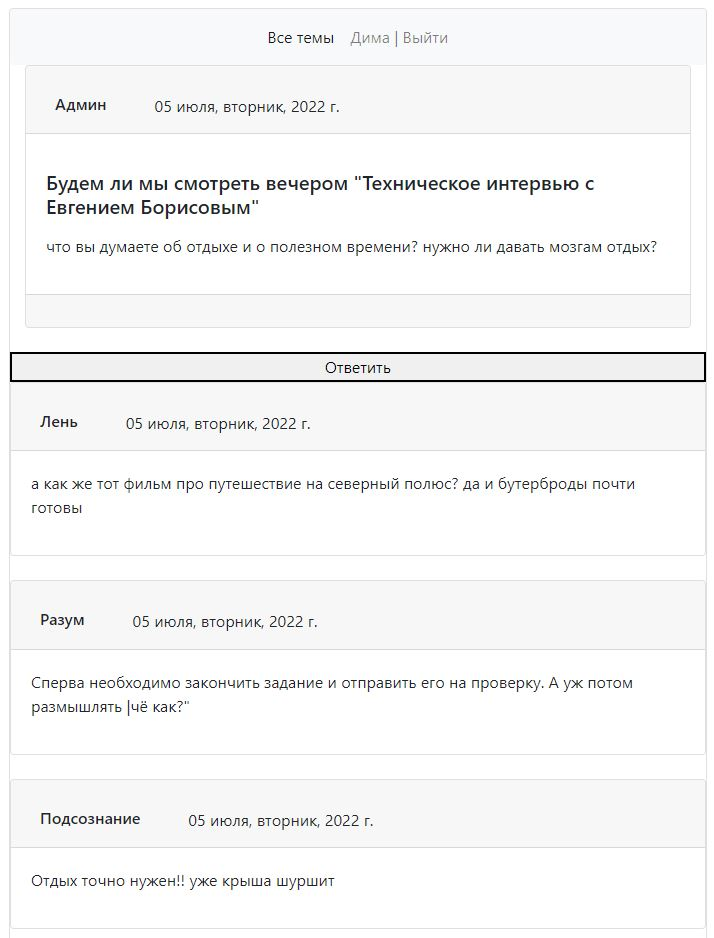
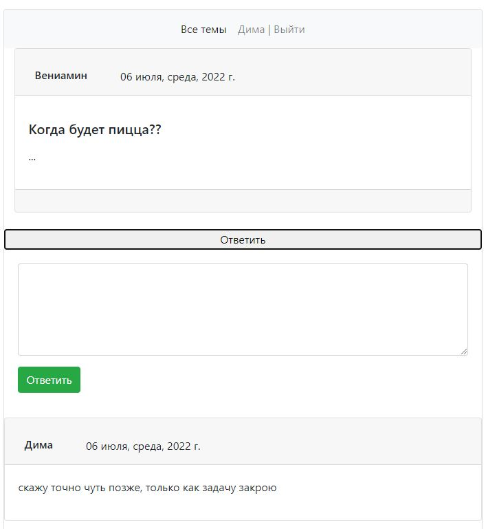
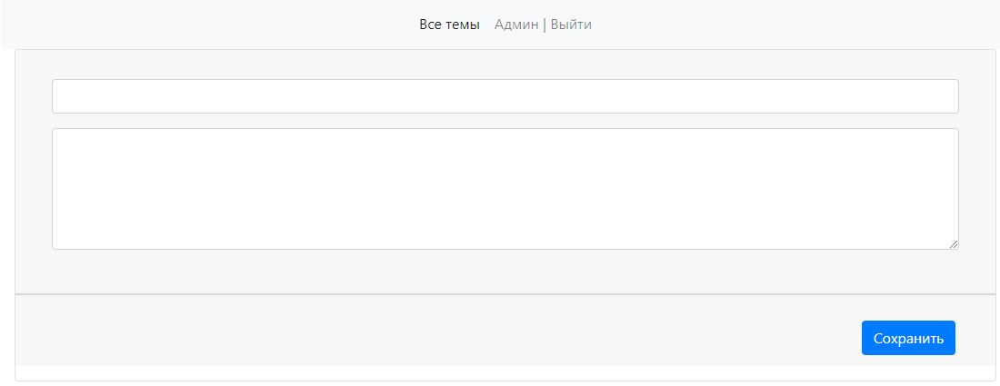

# job4j_forum -  Приватный форум
О проекте: тестовое задание по Spring data

Сборка или установка:
собирается через Maven

Как использовать: пока просто смотреть)

Стек технологий: Spring boot, Hibernate, jsp.

Контакты:https:
//github.com/zweidmitr

Описание: разработать многопользовательское вэб приложенеи для обсуждения различных тем.
- при первом посещении происходит стандартная процедура регистрации.
- после пользователь попадает  на главную страницу, к выбору списка тем или открытия новой.

- нажав на интересующую тему, происходит переход на страницу обсуждения

- Чтобы оставить сообщение можно нажав на кнопку "Ответить"

- На главной странице можно открыть новую ветку обсуждения и задать интересующую Вас тему

Дополнительно:
- Автор может редактировать свое сообщение

- страница авторизации / регистрации

