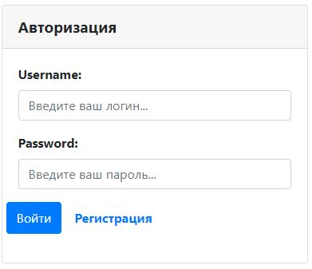

# Проект -  "Приватный форум"
О проекте: тестовое задание по Spring data

* [Описание](#описание)
* [Функционал](#функционал)
* [Технологии](#технологии)
* [Интерфейс](#интерфейс)
* [Автор](#автор)

 ## Описание 
Многопользовательское вэб приложениие для обсуждения различных тем.
Для хранения данных применяется Spring-Data.

 ## Функционал
* Регистрация пользователя
* Авторизация через БД PostgresSQL
* Просмотр существующих тем
* Открытие новой темы
* Ответы на интересующие темы
* Редактирование своей темы

## Технологии
* Spring-Boot
* Spring-Data
* Java 16
* PostgresSQL
* HTML, BOOTSTRAP
* lombok

## Архитектура
Проект реализован по шаблону MVC и разделен на слои:

1. Модели данных (Model)

1.1 [Post](src/main/java/ru/job4j/forum/model/Post.java) -
Модель для хранения тем обсуждений.

1.2 [Answer](src/main/java/ru/job4j/forum/model/Answer.java) -
Модель для хранения ответов пользователей.

1.3 [User](src/main/java/ru/job4j/forum/model/User.java) -
Модель для хранения данных пользователей.

1.4 [Authority](src/main/java/ru/job4j/forum/model/Authority.java) -
Модель для хранения ролей пользователей.

2. Хранилища (Store)

2.1 [PostRepository](src/main/java/ru/job4j/forum/repository/data/PostRepository.java) - 
Интерфейс для Spring Data: хранилище тем на форуме.

2.2 [AnswerRepository](src/main/java/ru/job4j/forum/repository/data/AnswerRepository.java) -
Интерфейс для Spring Data: хранилище ответов пользователей

2.3 [UserRepository](src/main/java/ru/job4j/forum/repository/data/UserRepository.java) -
Интерфейс для Spring Data: хранилище пользователей

2.4 [AuthorityRepository](src/main/java/ru/job4j/forum/repository/data/AuthorityRepository.java) -
Интерфейс для Spring Data: хранилище ролей пользователей

3. Контроллеры (Control)

3.1 [RegControl](src/main/java/ru/job4j/forum/control/RegControl.java) -
Контроллер регистрации

3.2 [LoginControl](src/main/java/ru/job4j/forum/control/LoginControl.java) - 
Контроллер авторизации

3.3 [PostControl](src/main/java/ru/job4j/forum/control/PostControl.java) - 
Контроллер по работе с темами и ответами на форуме

## Интерфейс 
* Интерфейс приложения

* Регистрируемся

* Автроризируемся

* Просматриваем интересующие темы

* Отвечаем на зацепившее сообщение

* Создаем свою ветку сообщений

* Редактируем свою тему

 

## Автор
Дмитрий 

Java-разработчик

zweidmitr@gmail.com